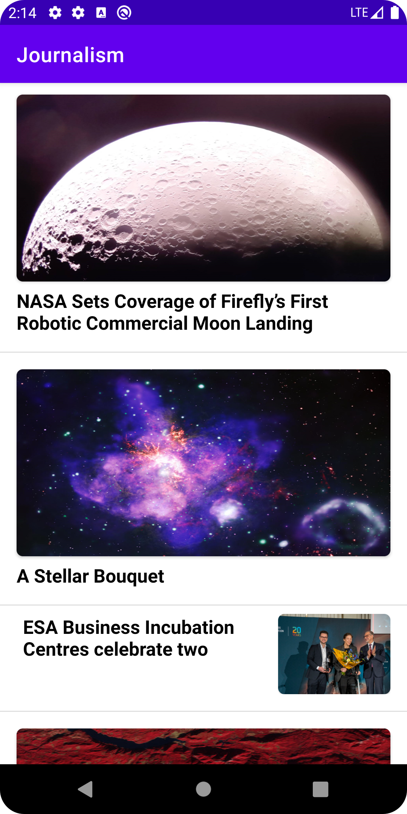

# Journalism 


**Journalism App** is a simple modern **offline-first** news application built with **Clean MVVM architecture**.    
It fetches news from the server, caches it to the local database, and retrieves them to use.  

## Screenshots



## How it work?  
The app first checks **Room Database** for news. 
- If no data is available, it fetches news from the server and saves it locally.
- When refreshing by user, all previous data is **deleted and replaced** with the latest news.

## Technologies Used
- **First-Offline App** – News is stored locally for offline access *(you can see: [developer.android.com/offline-first](https://developer.android.com/topic/architecture/data-layer/offline-first))*  
- **Clean MVVM Architecture** – Includes Data Source layer to separate concerns.  
- **Retrofit API request** – Send a request to the server to get data.  
- **Room Database** – Caches news for offline reading.  
- **Hilt Dependency Injection** – Ensures efficient dependency management.  
- **Coroutines & Dispatchers** – Optimized for background processing.  
- **DiffUtil and ListAdapter for RecyclerView** – Smooth UI updates.
 
## API Source
This application fetches news from the **[Spaceflight News API](https://spaceflightnewsapi.net/)**.

## License
```
MIT License

Copyright (c) 2025 Mohamadreza Aletaha

Permission is hereby granted, free of charge, to any person obtaining a copy
of this software and associated documentation files (the "Software"), to deal
in the Software without restriction, including without limitation the rights
to use, copy, modify, merge, publish, distribute, sublicense, and/or sell
copies of the Software, and to permit persons to whom the Software is
furnished to do so, subject to the following conditions:

The above copyright notice and this permission notice shall be included in all
copies or substantial portions of the Software.

THE SOFTWARE IS PROVIDED "AS IS", WITHOUT WARRANTY OF ANY KIND, EXPRESS OR
IMPLIED, INCLUDING BUT NOT LIMITED TO THE WARRANTIES OF MERCHANTABILITY,
FITNESS FOR A PARTICULAR PURPOSE AND NONINFRINGEMENT. IN NO EVENT SHALL THE
AUTHORS OR COPYRIGHT HOLDERS BE LIABLE FOR ANY CLAIM, DAMAGES OR OTHER
LIABILITY, WHETHER IN AN ACTION OF CONTRACT, TORT OR OTHERWISE, ARISING FROM,
OUT OF OR IN CONNECTION WITH THE SOFTWARE OR THE USE OR OTHER DEALINGS IN THE
SOFTWARE.
```
